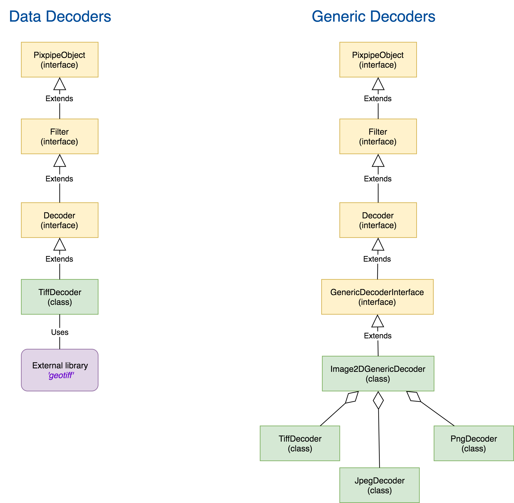

# Core description
Pixpipe is strongly *object oriented* and relies a lot on inheritance. It was inspired by *ITK* for its genericity because it makes the pipeline scalable and modular.
Everything you can find in `src/core` is the **core**. Easy. Let's see how it looks like:

As you can see, the core elements can be described like this: **containers** on one side and **processors** on the other.

# Generic Interfaces
### PixpipeObject
*generic interface*  
The most generic! You cannot do anything with it except extending it and **every** object in Pixpipe is (and must be) a `PixpipeObject`.  
`PixpipeObject`is an `interface`, it implements the following features:  
- **UUID**: a unique identifier for each and every object created in the pipeline. Since it is not practical to access memory addresses in Javascript, this is very useful for debugging your program and make sure that "This is the deep copy of an object rather than a pointer to the same address".
- **Metadata**: every description, setting or relevant piece of information **must** be stored in metadata, all the methods to create/read/modify are here. Don't put large arrays of data here, and don't put TypedArrays as it does not play well with serialization (see: pixp format).
- **Type**: every object must have a type descriptor (String). It can be there own or the type of their mother class. For example `Image3D` has the type *"IMAGE3D"* and `MniVolume` does not overwrite it, hence, it also has the type descriptor *"IMAGE3D"*. This is mainly used to ensure compatibility between data containers.  
[Read more](http://www.pixpipe.io/pixpipejs/doc/#PixpipeObject).

## PixpipeContainer
*container interface*  
So far, a `PixpipeObject` is still not containing any data, only a few metadata. To fix that and create a proper container able to store a large amount of data, `PixpipeContainer` introduces a new attribute: `_data`.  
Initialize to `null`, we profit from Javascript's dynamic typing ability to make it store whatever we want.  
For the sake of easily creating a specialized object from a pixp file, this interface also implements `setRawMetadata()` and `setRawMetadata()` but don't use them too much since there is absolutely no control, just raw object pointer attribution.
This is still an `interface` and even though you could probably use it *as-is*, this is not the point.  
[Read more](http://www.pixpipe.io/pixpipejs/doc/#PixpipeContainer).

## PixpipeContainerMultiData
*container interface*  
A `PixpipeContainerMultiData` object does not exist as is, this is an interface to data-structures which need to encode multiple numerical buffers, possibly of different types, each of them having a name (or ID, as you prefer to call it).  
For example, say you need a data-structure that needs 1D measurement (like a `Signal1D`) but also need to associate an integer for each of these measurement (for example a class, if you want to make clusters), then you will most likely need a `Float32Array` for measurement and a `Uint8Array` for classifing. A type that inherits `PixpipeContainerMultiData` will serve this purpose and all the methods that are already there will help you save time.  
[Read more](http://www.pixpipe.io/pixpipejs/doc/#PixpipeContainerMultiData).

## Filter
*processor interface*  
A `Filter`'s job is to process an input data in a **non-destructive** way and output another data. `Filter` is an interface, it cannot be used *as-is*, and you'll need to extend it to implement your own filter.  
Filters' input can be of any type or Object (`Image2D`, `Image3D`, `ArrayBuffer`, `JSON`, etc.) and must always be set using the method `.addInput( Object, category)` where `Object` is the input object itself and `category` is a `Number` or a `String` that will be used as an internal identifier. Most of the time it is convenient to use an incremental integer as a category but if your needs only *one* input, the argument `category` is optional and the category `0` will be given.  
Launching a filter is mandatory in order to get any output, this is done by calling the method `.update()`. Though, you will have to implement the method `._run()` (no argument) and possibly some other internal private method to help `_run` to do the job.  
When `.update()` is done, a filter is ready to give some output, using the method `.getOutput(category)`, when category is an optional identifier (default: 0).  

If you happen to create your own custom filter, **always** add some input verification before doing any real job using *inputs*. This is better than throwing exceptions away and breaking the pipeline.  
[Read more](http://www.pixpipe.io/pixpipejs/doc/#Filter).

## ImageToImageFilter
*processor interface*  
This extends `Filter` but still does not process anything. This is again an interface for any custom filter that would input one or multiple `Image2D` and output one `Image2D` (actually, this is not strictly required, it could output anything else, like statistics for examples).  
`ImageToImageFilter` provides a method to check if all the input `Image2D` have the same size: `.hasSameSizeInput()` and if they have the same number of components per pixel: `.hasSameNcppInput()`. These two methods should be called at the beginning of the `._run()` method, but if your custom filter happens *not* to need these verifications, then simply don't call them.  
[Read more](http://www.pixpipe.io/pixpipejs/doc/#ImageToImageFilter).

# Specialized Objects

## Image2D
*container*  
One of the most important containers, it is made to store 2D image datasets, for example coming from a *jpeg** image.  
This class contains everything needed to initialize, get and set pixel values.  
The information of *width*, *height* and *ncpp* (number of components per pixel, 3 for RGB, 4 for RGBA) are all stored into *metadata* but they can all be fetched using dedicated *getters*.  
In term of dimensionality, `Image2D` pixels are stored *row-wise* in a 1D TypedArray: the whole line1 RGBARGBA followed by the second line2, etc.  
[Read more](http://www.pixpipe.io/pixpipejs/doc/#Image2D).

## Image3D
*container - soon to be deprecated*  
The equivalent of `Image2D` for 3d datasets. Unlike 2D datasets, 3D ones have a parametric dimensionality order. By default, the largest dimensionality is along `xspace` and the smallest is along `zspace`. Since all dimensionality information are stored in metadata, the order can be changed, especially when initializing the Image3D with `setData()` with the appropriate `options`.  
`Image3D` have the *built-in*  ability to export `Image2D` object of slices (at a given position along a given axis) without using an external filter.  
[Read more](http://www.pixpipe.io/pixpipejs/doc/#Image3D).

## MniVolume
*container*  
This object is motivated by the medical dataset used internally in the [Montreal Neurological Institute](http://www.mcgill.ca/neuro/about): [NIfTI](https://nifti.nimh.nih.gov/), [Minc2](http://journal.frontiersin.org/article/10.3389/fninf.2016.00035/full) and [MGH/MGZ](https://surfer.nmr.mgh.harvard.edu/fswiki/FsTutorial/MghFormat). They are respectively created by `NiftiDecoder` and `Minc2Decoder`. Keep in mind `MniVolumes` are `Image3D` and uses the same methods.  
[Read more](http://www.pixpipe.io/pixpipejs/doc/#MniVolume).

## Image3DAlt
*container*  
This container is also for volume data, handles everything from *MniVolume* but with better metadata and affine transformations.  
[Read more](http://www.pixpipe.io/pixpipejs/doc/#Image3DAlt).

## Signal1D
*container - soon to be deprecated*  
Like `Image2D` stores a 2D signal, the `Signal1D` is intended to store single dimensional signals, for example intensities of an EEG. There are special filters associated with this container, for example to perform Fourier Transform.  
[Read more](http://www.pixpipe.io/pixpipejs/doc/#Signal1D).

## LineString
*container*  
A `LineString` is a vectorial representation of a polyline in a space of a given number of dimensions. In 2D by default, this can be changed using the method `.setNod(Number)` to 3D or even more, as long as it makes sense for the application. A line string can be closed whn calling the method `.close()` so that it becomes a polygon. Points can be added (to the end) or popped (from the end).  
The internal data structure of a LineString is a `Float32Array` and If a line string lays in a 2D, the internal data will be represented as `[x1, y1, x2, y2, x3, y3, ...]`. This is very convenient when it comes to encode or compresse the data (e.g. for storing in a file) but the user should not have to deal directly with this structure and should use the dedicated methods to interact with a LineString.  
[Read more](http://www.pixpipe.io/pixpipejs/doc/#LineString).

## Mesh3D
*container*  
The `Mesh3D` class is a good example of usage of `PixpipeContainerMultiData`. An instance of `Mesh3D` represents a mesh, in 3D, aka a surface. To serve this purpose, it stores **four** types of data:
- the vertex positions, as an array of `[x0, y0, z0, x1, y1, z1, ...]` (`Float32Array`)
- the list of each each vertex index grouped by 3 (if faces are triangles) such as `[Va0, Va1, Va2, Vb0, Vb1, Vb2, ...]` where `a` is the first triangle, `b` is the second...  (`Uint32Array`)
- the polygons/triangles' normal vectors `[x0, y0, z0, x1, y1, z1, ...]`. Even though those could be computed with a cross product using a *right hand* rule, it can be convenient the list them in case all the faces don't follow this rule. (`Float32Array`)
- the vertex colors as a list of RGBa such as `[V0R, V0G, V0G, V0a, V1R, V1G, V1B, V1a, ...]` (`Uint8Array`)
Each of these structure can be set from dedicated methods and you should not have to deal with low level private arrays.  
[Read more](http://www.pixpipe.io/pixpipejs/doc/#Mesh3D).

# Decoders
As we have seen earlier, `Filter` take inputs, perform a task and give outputs. Most of the time, processing data means there is a preliminary step of getting these data from existing files. Reading a file, *decoding*, is a task that can be performed in Pixpipe, directly in the browser with Javascript. Before going further on how to access a file buffer and how to create a `Image2D` out of a Jpeg file, we need to be clear on the existing pieces to use to do it, so that we don't reinvent the wheel.  

Notice: What we call *Data Decoder* does not match to any class name in Pixpipe, it is just a general term used for the sake of this explanation and the same goes for *Generic Decoders*.

Here, we are taking the example of `TiffDecoder`. As its name implies, it takes the `ArrayBuffer` of a Tiff file in input and outputs an `Image2D`.  
The class `TiffDecoder` is a special kind of `Filter` because it inherits from the interface `Decoder` (and `Decoder` inherit from `Filter`). This interface adds the logic responsible for dealing with inputs of different kinds; by default of a binary format, but some files are text-based. Other than that, a `Decoder` is just like a `Filter`.  
Since we don't want to reinvent the wheel, we don't want to reimplement a Tiff parser if a good one is already out there, this is why the last link of the chain, `TiffDecoder`, has a dependency to the [Geotiff](https://github.com/constantinius/geotiff.js) library.

As a separate matter and in order to simplify the usage of Pixpipe to other developers, we decided it would be nice to have a decoder that handles different kinds of files without having to specify if it's a PNG, a Jpeg or a Tiff. In the end, this decoder would just output an `Image2D`. This it what we call *Generic Decoders*.  
Those ones work a bit like regular decoder but instead of relying on external libraries to do the job, they rely on decoders that already exist in Pixpipe. When the `update()` method is called, these generic decoders will successively attempt to decode the buffer with each decoders specified in the list (`this._decoders`) until it succeed.

<!-- Enough with the theory, learn more about how to properly make your own file decoder in Pixpipe [here](/5-make-your-own-filter/4-custom-decoders.md) -->
